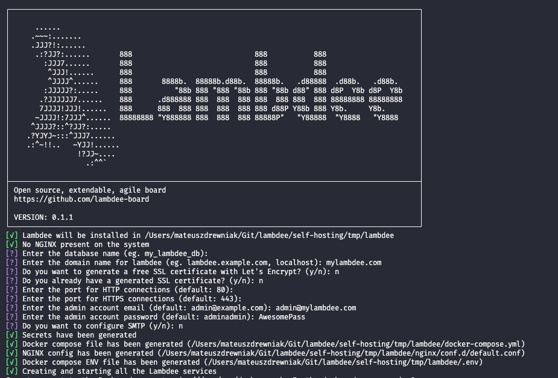
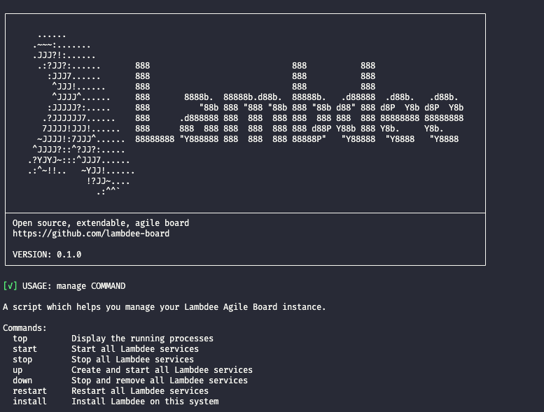

---
# Feel free to add content and custom Front Matter to this file.
# To modify the layout, see https://jekyllrb.com/docs/themes/#overriding-theme-defaults

layout: default
title: Getting Started
nav_order: 2
---

# Getting Started

Lambdee is self hosted, so you will have
to host it on your own server to use it, or use
someone's hosted instance.

## Installation

There is an easy to use installation script which will setup
lambdee on any Linux server.

You can visit our [self-hosting Github Repo](https://github.com/lambdee-board/self-hosting) for more details.

```sh
curl -sSL http://raw.githubusercontent.com/lambdee-board/self-hosting/main/bin/prod/install > lambdee_install; bash lambdee_install
```

This command will setup lambdee for you
and gently ask you how you would like
to do it.



By default Lambdee is installed in `/opt/lambdee`, but you
may choose another directory if you feel so inclined.

Lambdee will be automatically started after the installation succeeds.

## Management script

Afterwards you can interact with your Lambdee instance
by running the `manage` script in the installation folder.

By default it will be `/opt/lambdee/manage`.

It supports actions such as stopping, restarting, showing all processes etc.

You can call it like so:

```sh
/opt/lambdee/manage top # show all processes
/opt/lambdee/manage stop # stop all processes
/opt/lambdee/manage restart # restart all processes
```



