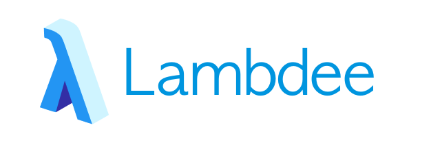
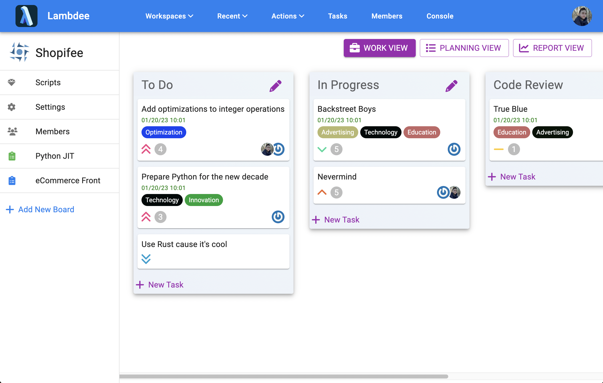
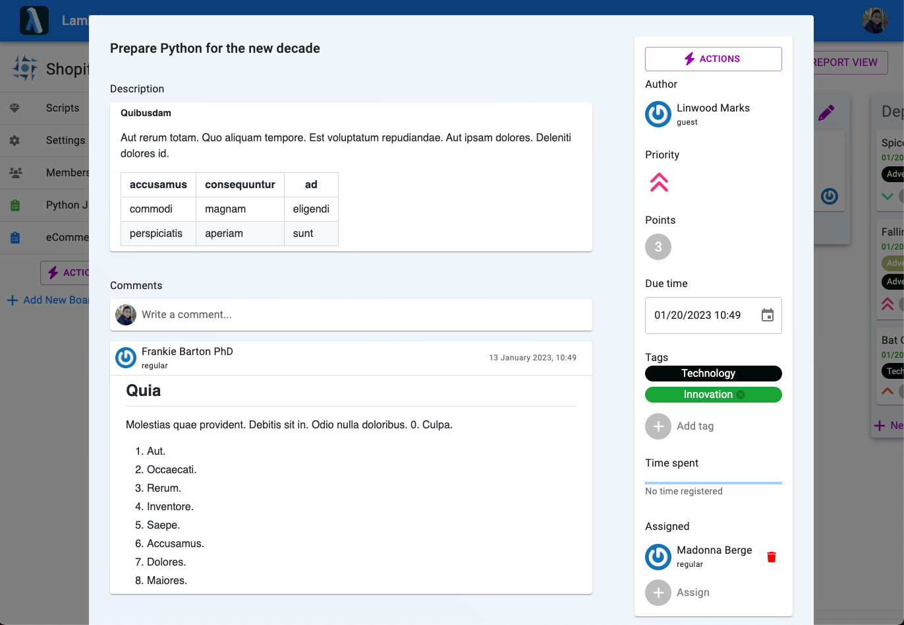
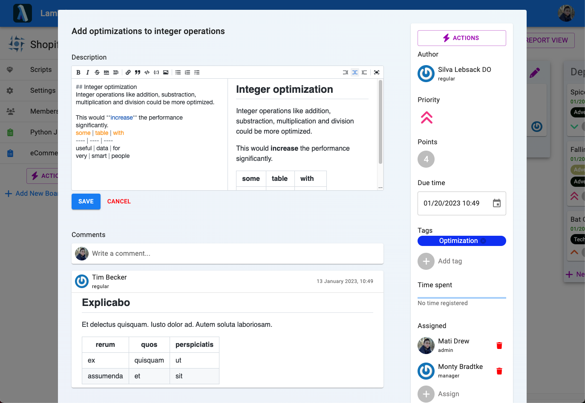
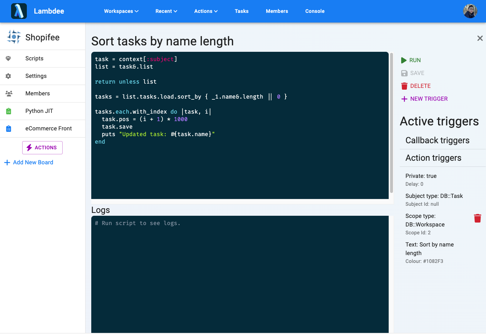
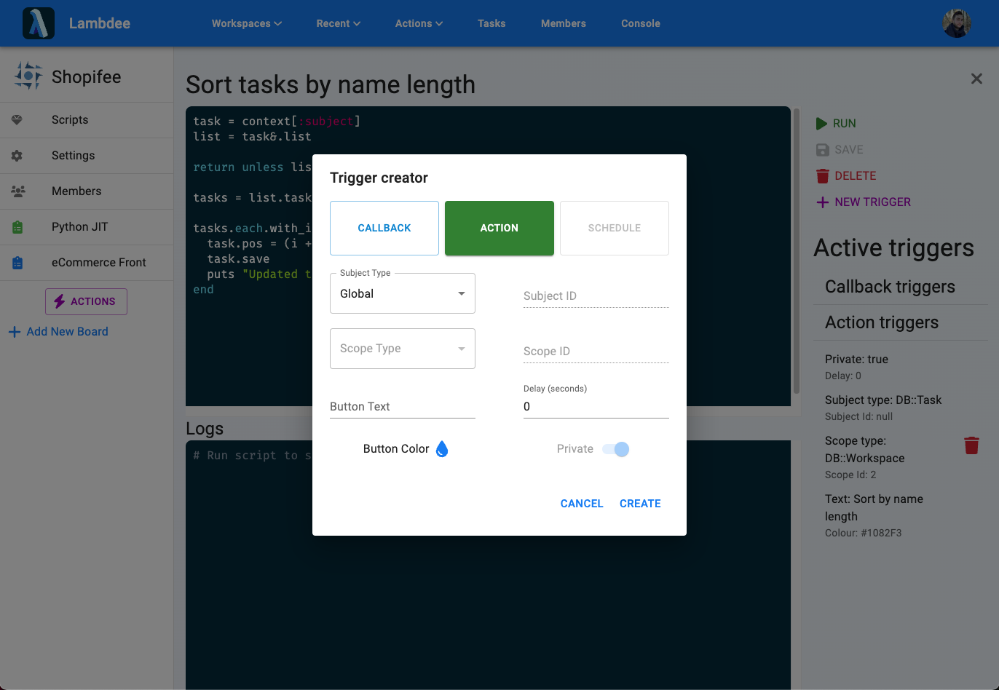

---
# Feel free to add content and custom Front Matter to this file.
# To modify the layout, see https://jekyllrb.com/docs/themes/#overriding-theme-defaults

layout: default
title: About
nav_order: 1
---

# What is Lambdee?

Lambdee is an OpenSource self-hosted
agile board which supports writing automation
scripts in Ruby.

## Fully featured agile board

It's got everything you would expect from an agile board
like Trello and has got an intuitive UI.

{: .important }
And the most important part is that it's extremely,
almost dangerously customizable.

## Rich text with Markdown

Be as expressive as you want
and feel like a pro while
planning your work.

You can make write expressive descriptions and comments
with the use of our Markdown editor.

## Custom scripts

Customize the behaviour of your Lambdee instance
with Ruby scripts.

You can test them using our Editor.

Scripts can be hooked up as callbacks
or action buttons. We call them "triggers".

## Self hosted

Lambdee is a project focused on self hosting.
You are free to host Lambdee on your server.
